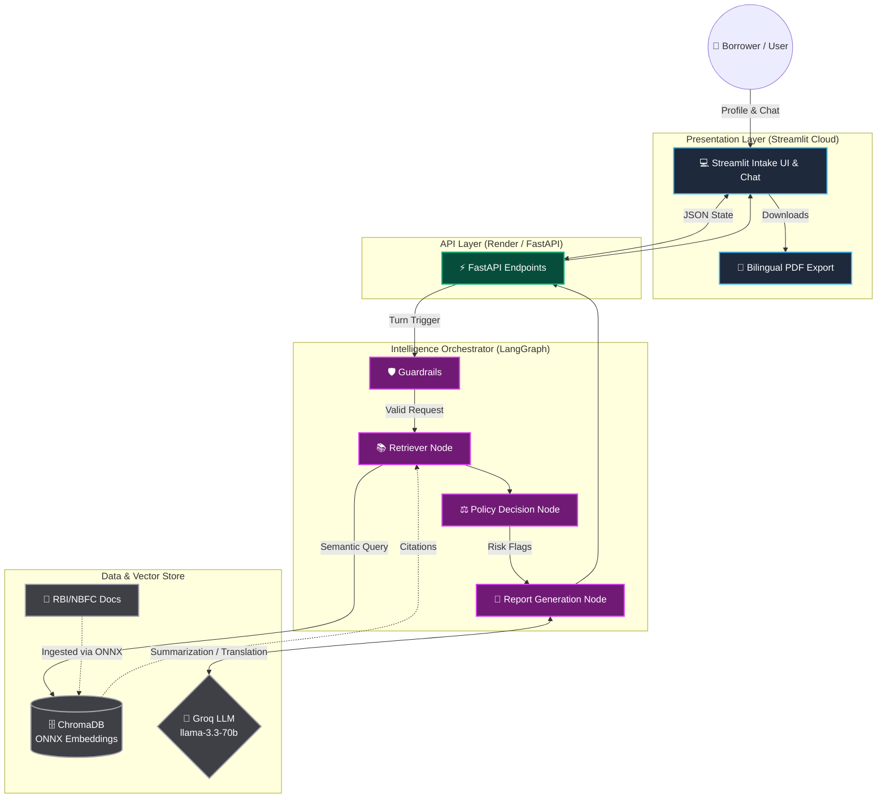

# 🏦 CreditSense v2: AI-Powered Loan Approval Agent

<div align="center">
  
  
  
</div>
<br>

**CreditSense v2** is a professional, bilingual (English/Hindi) AI credit assessment platform. It combines a deterministic policy engine, RAG-backed regulatory knowledge (RBI & NBFC guidelines), and LangGraph agent orchestration to provide explainable loan decisions.

---

## 📊 Visual System Architecture

Understanding how CreditSense works is critical for auditability. We utilize a **hybrid deterministic-AI pipeline** that ensures strict policy enforcement with natural language reasoning.



> **Why ONNX over PyTorch?** 
> To support lightning-fast ultra-lightweight deployments on Streamlit Community Cloud and Render Free Tier, we fully modernized the vector stack. `SentenceTransformers` and `PyTorch` (2GB+) were replaced by Chroma's native **`ONNXMiniLM_L6_V2`** engine (50MB), yielding the exact same inference outputs at 5% of the memory footprint.

---

## 📑 The Professional Visual Report (LaTeX)

For deep academic or architectural review, compile our highly structured **LaTeX Visual Technical Report**. It includes technical depth, data-flow diagrams, and viva-voce talking points.

- **LaTeX Source:** [`docs/CreditSense_M2_Professional_Report.tex`](docs/CreditSense_M2_Professional_Report.tex)
- **Compiled PDF:** [`docs/CreditSense_M2_Professional_Report.pdf`](docs/CreditSense_M2_Professional_Report.pdf) 
*(Note: To generate the newest PDF, compile the `.tex` file locally or on Overleaf since automated GitHub compilation is skipped for file size).*

> 💡 **Tip:** Use these `docs/` files directly as your script and visual aid to build your professional PowerPoint (PPT) presentation!

---

## 🚀 Quick Start (Local Deployment)

Run the full dual-stack locally using the terminal commands below from the `MILESTONE_2/creditsense` directory.

```bash
cd "MILESTONE_2/creditsense"

# 1. Install dependencies
pip install -r requirements.txt

# 2. Ingest Reference Documents (Optional: if chroma_store is missing)
python3 scripts/ingest.py --source-dir "../../RAG files"

# 3. Boot the API Layer
bash scripts/run_backend.sh

# 4. Open a second terminal and Boot the UI Layer
bash scripts/run_streamlit.sh
```

**Local Endpoints**:
- 🎨 Frontend: `http://localhost:8502`
- ⚙️ Backend API: `http://localhost:8010`

---

## 📂 Project Navigation

| Directory | Purpose |
|---|---|
| 🌲 [`MILESTONE_2/`](MILESTONE_2/) | **Primary Codebase:** The entire Streamlit + FastAPI + LangGraph architecture. |
| 📚 [`docs/`](docs/) | **Documentation Map:** Deep dives into API, deployment, design specs, and LaTeX reports. |
| 🗃️ [`RAG files/`](RAG%20files/) | **Corpus:** The raw regulatory documents feeding the intelligence layer. |
| 🕰️ [`MILESTONE 1/`](MILESTONE%201/) | **Legacy:** The original prototype terminal app. |
