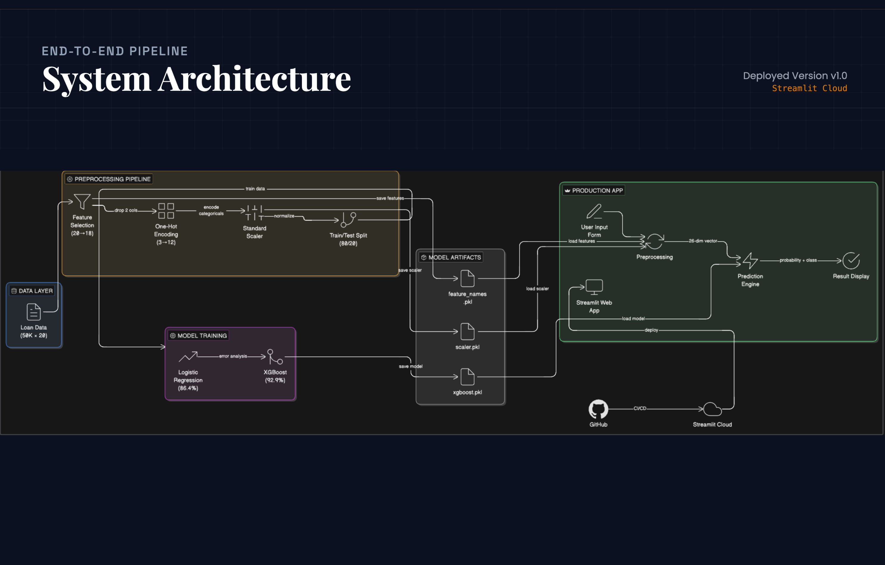

# Project 10: Loan Approval Prediction System

## From Classical ML to Production Deployment



---


---

## 🚀 Live Demo

### **[→ Try the Loan Approval Predictor](https://mitul-bhatia-gen-ai-loan-approval-appapp-rtzjzl.streamlit.app/)**

---

### Links

| Resource | URL |
|:---|:---|
| **Live Demo** | [https://mitul-bhatia-gen-ai-loan-approval-appapp-rtzjzl.streamlit.app/](https://mitul-bhatia-gen-ai-loan-approval-appapp-rtzjzl.streamlit.app/) |
| **GitHub Repository** | [https://github.com/mitul-bhatia/GEN_AI_LOAN_APPROVAL](https://github.com/mitul-bhatia/GEN_AI_LOAN_APPROVAL) |
| **Overleaf Report** | [https://www.overleaf.com/9578946939ssybpphmccjs#d6b01d](https://www.overleaf.com/9578946939ssybpphmccjs#d6b01d) |
| **Video** | [https://drive.google.com/drive/folders/1rssYqeT01-XKuvAYE21OtGUzJ122Ak6O?usp=drive_link](https://drive.google.com/drive/folders/1rssYqeT01-XKuvAYE21OtGUzJ122Ak6O?usp=drive_link) |

---

### Project Overview

This project implements an **AI-driven loan approval prediction system** using classical machine learning techniques applied to a 50,000-record customer dataset.

- **Milestone 1 (Current):** End-to-end ML pipeline from EDA to production deployment, featuring error analysis methodology that improved accuracy from 86% to 93%.
- **Milestone 2 (Upcoming):** Extension into an agentic AI system with RAG-based financial reasoning.

---

### Constraints & Requirements

| Requirement | Status |
|:---|:---|
| **Team Size** | 4 Students ✅ |
| **API Budget** | Free Tier Only ✅ |
| **Framework** | Scikit-learn, XGBoost ✅ |
| **Hosting** | Streamlit Cloud ✅ |

---

### Technology Stack

| Component | Technology |
|:---|:---|
| **Language** | Python 3.13 |
| **ML Models** | Logistic Regression, XGBoost |
| **ML Libraries** | Scikit-learn 1.8, XGBoost 3.2 |
| **Visualization** | Plotly, Seaborn, Matplotlib |
| **UI Framework** | Streamlit 1.54 |
| **Deployment** | Streamlit Cloud |
| **Version Control** | Git + GitHub |
| **Documentation** | LaTeX (Overleaf) |

---

### Milestone 1: ML-Based Loan Approval Prediction (Mid-Sem)

**Objective:** Build a production-ready loan approval classifier using classical ML techniques with rigorous error analysis.

#### Key Deliverables

| Deliverable | Status | Details |
|:---|:---|:---|
| Problem Understanding | ✅ | Binary classification on 50K × 20 dataset |
| System Architecture | ✅ | End-to-end pipeline diagram |
| EDA & Visualizations | ✅ | 6 comprehensive charts |
| Feature Engineering | ✅ | 20 → 18 features, One-Hot → 26 total |
| Baseline Model (LR) | ✅ | **86.42% accuracy** |
| Error Analysis | ✅ | Discovered `credit_score × DTI` interaction |
| Advanced Model (XGBoost) | ✅ | **92.86% accuracy** (+6.44%) |
| Production Deployment | ✅ | [Live on Streamlit Cloud](https://mitul-bhatia-gen-ai-loan-approval-appapp-rtzjzl.streamlit.app/) |
| Documentation | ✅ | LaTeX Report + Video Script |

---

### Model Performance

| Model | Accuracy | Precision | Recall | F1-Score | ROC-AUC |
|:---|:---|:---|:---|:---|:---|
| Logistic Regression | 86.42% | 86.91% | 88.68% | 87.79% | 94.39% |
| **XGBoost** | **92.86%** | **92.65%** | **94.53%** | **93.58%** | **98.42%** |

#### Why XGBoost Won

| LR Limitation | XGBoost Solution |
|:---|:---|
| Additive effects only | Trees capture feature interactions |
| Smooth decision boundary | Step functions via splits |
| Single classifier | Ensemble of 200 trees |

**Key Discovery:** The interaction `credit_score × DTI` predicts classification errors **5x better** than either feature alone (r=0.166 vs r≈0.03). This explains 40% of Logistic Regression's errors.

---

### Dataset

**50,000 loan applications** with **20 features:**

| Category | Features |
|:---|:---|
| **Demographics** | `age`, `occupation_status`, `years_employed` |
| **Financial** | `annual_income`, `savings_assets`, `current_debt` |
| **Credit History** | `credit_score`, `credit_history_years`, `defaults_on_file`, `delinquencies_last_2yrs`, `derogatory_marks` |
| **Loan Details** | `product_type`, `loan_intent`, `loan_amount`, `interest_rate` |
| **Ratios** | `debt_to_income_ratio`, `loan_to_income_ratio`, `payment_to_income_ratio` |
| **Target** | `loan_status` (0: Rejected, 1: Approved) |

---

### Project Structure

```
GEN_AI_LOAN_APPROVAL/
│
├── app/
│   └── app.py                      # Streamlit web application
│
├── data/
│   ├── raw/                        # Original dataset
│   │   └── loan_approval_data.csv
│   └── processed/                  # Train/test splits, scalers
│       ├── X_train.csv, X_test.csv
│       ├── y_train.csv, y_test.csv
│       ├── scaler.pkl
│       └── feature_names.pkl
│
├── models/
│   ├── logistic_regression.pkl     # Baseline model (86.42%)
│   └── xgboost.pkl                 # Production model (92.86%)
│
├── notebooks/
│   ├── 01_EDA.ipynb                # Exploratory Data Analysis
│   ├── 02_ML_Models.ipynb          # Logistic Regression
│   ├── 03_Error_Analysis.ipynb     # Why LR stuck at 86%?
│   └── 04_XGBoost.ipynb            # XGBoost (92.86%)
│
├── report/
│   ├── main.tex                    # LaTeX report (Overleaf)
│   ├── PROJECT_REPORT.md           # Markdown report
│   ├── system_architecture.png     # Architecture diagram
│   └── *.png                       # 14 visualizations
│
├── .streamlit/
│   └── config.toml                 # Streamlit configuration
│
├── requirements.txt                # Dependencies
├── .gitignore
└── README.md
```

---

### Installation & Setup

#### Prerequisites
- Python 3.11+
- pip

#### Quick Start

```bash
# Clone the repository
git clone https://github.com/mitul-bhatia/GEN_AI_LOAN_APPROVAL.git
cd GEN_AI_LOAN_APPROVAL

# Create virtual environment
python -m venv .venv
source .venv/bin/activate  # Windows: .venv\Scripts\activate

# Install dependencies
pip install -r requirements.txt

# Run the app locally
streamlit run app/app.py
```

The app will open at `http://localhost:8501`

---

### Methodology

```
1. EDA           → Analyzed 50K samples, 20 features
                   Identified credit_score (+0.50) as strongest predictor

2. Preprocessing → Feature selection (20 → 18)
                   One-Hot Encoding (3 categorical → 12)
                   StandardScaler (14 numerical)
                   Final: 26-dimensional feature vector

3. Baseline      → Logistic Regression: 86.42% accuracy
                   Identified 1,358 classification errors

4. Error         → Found 52% of errors are "confidently wrong" (prob > 0.7)
   Analysis        Discovered credit_score × DTI interaction (r=0.166)

5. XGBoost       → 200 trees, max_depth=5, learning_rate=0.03
                   Captured nonlinear interactions
                   Final: 92.86% accuracy (+6.44% improvement)

6. Deployment    → Streamlit Cloud production deployment
                   Real-time predictions with confidence scores
```

---

### Team

| Member | Role | Contribution |
|:---|:---|:---|
| **Mitul Bhatia** | Team Lead | ML Development, Streamlit App, Error Analysis |
| **Hardik** | System Architect | Architecture Design, Pipeline Documentation |
| **Vaibhav** | Documentation Lead | LaTeX Report, README, Technical Writing |
| **Sarvjeet** | Presentation Lead | Video Script, Slides, Demo Preparation |

---


### Final Deliverables (PDF)

All final submission documents are available in the [`Pdf/`](Pdf/) folder.

---

### License

This project is submitted as part of the **NST GenAI Capstone Project (Milestone 1)** at Newton School of Technology.

---

*Mid-Semester AI/ML Capstone Project | Newton School of Technology | February 2026*
