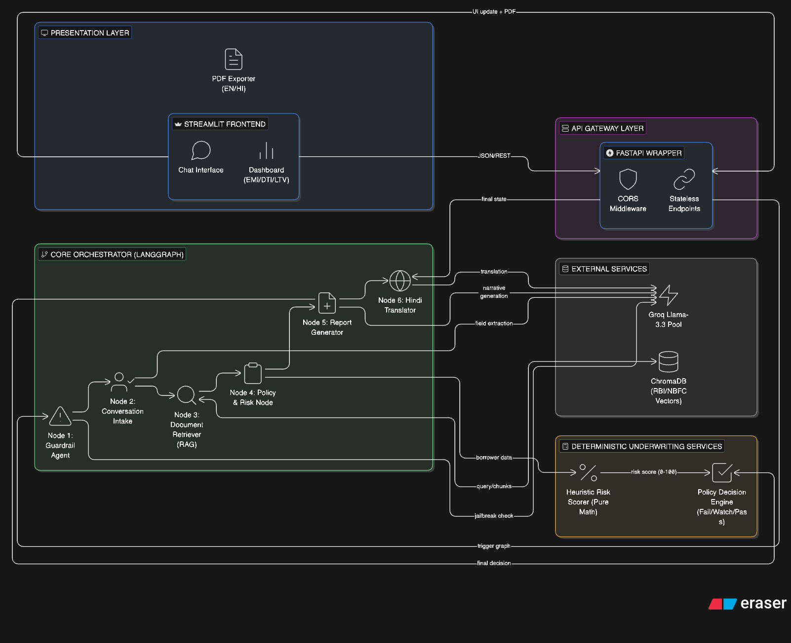

# CreditSense v2: AI-Assisted Credit Risk Assessment Platform

## An Autonomous Multi-Agent Underwriting System

---

## Abstract

The traditional loan underwriting process is heavily manual, subjective, and prone to latency. Conversely, integrating generalized Large Language Models (LLMs) into financial ecosystems introduces catastrophic regulatory risk due to AI "hallucinations" and a lack of auditability.

This report presents **CreditSense v2**, an autonomous, multi-agent underwriting platform. By transitioning from a standard LLM chatbot to an **Agentic AI workflow** orchestrated via LangGraph, the system solves the critical hallucination problem. The architecture deploys discrete, specialized AI "agents" that execute sequential logic: conversational fact extraction, dynamic Retrieval-Augmented Generation (RAG) across RBI regulations, deterministic heuristic risk computing, and bilingual report synthesis. The result is a highly explainable, fully auditable, and compliant credit assessment pipeline that operates at machine speed.

---

## 1. Introduction: The Hallucination Problem & The Agentic Solution

In modern financing, decision latency directly impacts customer acquisition and operational overhead. However, the naive integration of generative AI into finance introduces severe compliance risks. A standard LLM lacks an internal state machine; it will confidently invent financial metrics or hallucinate regulatory clauses if prompted aggressively.

CreditSense v2 solves this by implementing an **Agentic Constraint Envelope**. Rather than using one monolithic AI model, the platform utilizes a **Multi-Agent System (MAS)**. The LLM is stripped of decision-making authority and is instead utilized as a semantic router and data extractor. The actual business logic—the decision to Approve, Conditional-Approve, or Escalate—is mathematically enforced by a deterministic policy matrix.

### Project Scope and Agentic Deliverables

The core architecture of the CreditSense v2 Agentic System includes:

- **LangGraph Orchestrator:** A stateful execution graph that strings together 6 specialized node workers, forcing the AI through a strict, auditable pipeline.
- **Autonomous Guardrails:** An interception agent that cryptographically blocks prompt-injection and non-financial queries before execution.
- **Local RAG Database (ChromaDB):** A vectorized memory bank utilizing lightweight ONNX embeddings to dynamically fetch exact RBI/NBFC regulatory clauses.
- **Deterministic Policy Engine:** The hard-coded mathematical engine that guarantees non-biased, mathematically sound credit decisions based on DTI and LTV constraints.

---

## 2. Core Team & Project Contributions

| Team Member | Official Responsibility | Key Architectural Contributions |
| :--- | :--- | :--- |
| **👨‍💻 Mitul** | **Project Lead & Full-Stack Development** | Spearheaded the overall software architecture. Engineered the FastAPI backend, Streamlit frontend, LangGraph orchestration, local RAG integration, and deployment pipelines. |
| **📚 Vaibhav** | **Technical Documentation & Report Strategy** | Structured and developed the comprehensive project documentation, system architecture records, READMEs, and the formal technical submission report. |
| **🖥️ Sarvjeet** | **Media & Presentation Lead** | Designed and delivered the final project presentation (PowerPoint), mapped the technical flow into digestible visual slides, and produced the final demo walkthrough video. |
| **💡 Hardik** | **Product Ideation & Strategy** | Led the initial concept framing, conceptualized the integration of RBI guidelines, structured the business logic requirements (e.g., Debt-to-Income, LTV ratios), and defined the target user-experience. |

---

## 3. System Architecture and Design

CreditSense utilizes a modern multi-tier microservice architecture to ensure speed, auditability, and scalability.

### Architectural Advancements: Migrating to ONNX

A critical requirement for this milestone was ensuring the platform could deploy on lightweight free-tier environments. Initially, the RAG pipeline utilized the standard `sentence_transformers` library, which forced a massive (2GB+) PyTorch dependency. This resulted in system crashes during deployment due to memory exhaust.

**The Solution:** We aggressively optimized our storage pipeline by swapping to ChromaDB's native **ONNX Runtime** (`ONNXMiniLM_L6_V2`). This achieved identical 384-dimensional semantic embeddings while shrinking the dependency footprint from 2.2GB to under 50MB, achieving perfect stability.

---

## 3. Implementation & Methodology

### LangGraph Multi-Agent Orchestration

Large Language Models left unchecked are prone to making autonomous, non-compliant leaps in logic. By implementing a state machine, the system orchestrates "Agents" (discrete LLM prompts with precise system instructions) ensuring the AI cannot skip to a generated report before the mandatory mathematics are complete. The agentic flow operates as follows:

1. **Guardrail Agent:** Uses heuristic keyword matching combined with an LLM verification pass to instantly reject off-topic (e.g., medical, political) prompts.
2. **Intake Agent:** Instead of merely chatting, this agent is tasked with a structured extraction mandate. It parses the user's natural language to populate a strict 15-field JSON schema representing the borrower's financial profile.
3. **RAG Retrieval Agent:** Automatically contextualizes the borrower's file by querying the local ChromaDB for overlapping rules in the 57+ official RBI PDF corpus.
4. **Policy Scoring Engine:** The LLM execution pauses here. Traditional math takes over, calculating exact Debt-to-Income and Net Loan-to-Value ratios.
5. **Reporting Agent:** Reactivates the LLM. It ingests the strict numerical outputs from the Policy Engine and transcribes them into an empathetic, human-readable English assessment.
6. **Translation Agent:** A final specialized LLM node strictly dedicated to rendering the semantic English meaning into formal Devanagari Hindi.

### Deterministic Heuristic Risk Scorer

To strictly adhere to financial compliance laws regarding "explainability," the system actively avoids black-box Machine Learning for loan approvals. Instead, an explicit mathematically weighted **Heuristic Risk Scorer** evaluates the borrower. The baseline score begins at 50/100 and scales positively for ideal profiles (e.g., Post-loan DTI ≤ 0.45, Credit Score ≥ 750) and penalizes heavily for previous payment defaults. This explicit mathematics guarantees 100% predictable and auditable decisioning.

### Bilingual PDF Export

Financial inclusivity requires accessible language. The system implements the `fpdf2` library paired with custom Unicode-compliant fonts (Noto Devanagari) to output highly formatted, downloadable PDF records of the complete transaction and regulatory citations.

---

## 4. Conclusion & Future Scope

CreditSense v2 successfully proves that modern Generative AI can be safely integrated into the highly-regulated fintech sector by combining flexible language chat with rigid, deterministic policy graphs. Through the collaborative efforts of the entire project team, the platform transitioned from ideation to a fully functional, cloud-deployed product yielding actionable bilingual credit reports.

**Future work includes:**

- Upgrading the local ChromaDB SQLite implementation to a clustered vector database (e.g., Pinecone or Weaviate).
- Implementing formal OAuth2 authentication mechanisms.
- Expanding the heuristic risk scoring engine with real-world historic default ML datasets.
